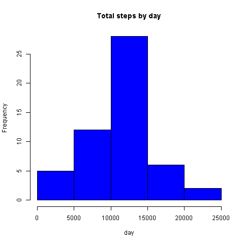

---
#PA1 REproducible Research
author: "Guillermo Jasso"
date: "Wednesday, January 14, 2015"
output: html_document
---

This document presents the results of the Reproducible Research's Peer Assessment 1 in a report using a single R markdown document that can be processed by knitr and be transformed into an HTML file

#We will start firts by Loading and preprocessing the data

```{r}
activity <- read.csv("activity.csv",colClasses = c("numeric", "character", "numeric"))
head(activity)
names(activity)
str(activity)
```

#Now we start answering the questions

##What is the mean total number of stepts taken per day?

### First we aggregate the data

```{r}
StepsTotal <- aggregate(steps ~ date, activity, sum)
```

###Then we plot the data on an Histogram


```{r}
hist(StepsTotal$steps, main = "Total steps by day", xlab = "day", col = "blue")
dev.copy(png, file="hist1.png", height=480, width=480)
dev.off()
```



##And the Mean and the Median are

```{r}
mean(StepsTotal$steps)
median(StepsTotal$steps)
```

##What is the average daily activity pattern?

###Getting the mean of steps and time series plot

```{r}
time_series <- tapply(activity$steps, activity$interval, mean, na.rm = TRUE)
```

###And then we plot the data

```{r}
plot(row.names(time_series), time_series, type = "l", xlab = "5-min interval",
     ylab = "Average across all Days", main = "Average number of steps taken",
     col = "blue")
dev.copy(png, file="hist2.png", height=480, width=480)
dev.off()
```

###Which 5-minute interval, on average across all the days in the dataset, contains the maximum number of steps?

```{r}
max_interval <- which.max(time_series)
names(max_interval)
```

##Imputing missing values

###Calculate and report the total number of missing values in the dataset

```{r}
activity_NA <- sum(is.na(activity))
activity_NA
```

###Devise a strategy for filling in all of the missing values in the dataset

###We will replaced NA by the mean in 5 min interval

```{r}
StepsAverage <- aggregate(steps ~ interval, data = activity, FUN = mean)
fillNA <- numeric()
for (i in 1:nrow(activity)) {
    obs <- activity[i, ]
    if (is.na(obs$steps)) {
        steps <- subset(StepsAverage, interval == obs$interval)$steps
    } else {
        steps <- obs$steps
    }
    fillNA <- c(fillNA, steps)
}
```

###Then we create a new dataset that is equal to the original dataset but with the missing data filled in

```{r}
new_activity <- activity
new_activity$steps <- fillNA
```

###Make a histogram of the total number of steps taken each day and Calculate and report the mean and median total number of steps taken per day

```{r}
StepsTotal2 <- aggregate(steps ~ date, new_activity, sum)
```

###We plot the data

```{r}
hist(StepsTotal2$steps, main = "Total steps by day", xlab = "day", col = "blue")
dev.copy(png, file="hist3.png", height=480, width=480)
dev.off()
```

###Mean and Median

```{r}
mean(StepsTotal2$steps)
median(StepsTotal2$steps)
```

##We found the values are just slightly different

#Are there differences in activity patterns between weekdays and weekends?

###Create a new factor variable in the dataset with two levels – “weekday” and “weekend” indicating whether a given date is a weekday or weekend day

```{r}
activity <- read.csv("activity.csv",colClasses = c("numeric", "Date", "numeric"))
daytype <- function(date) {
    if (weekdays(as.Date(date)) %in% c("Saturday", "Sunday")) {
        "weekend"
    } else {
        "weekday"
    }
}
activity$daytype <- as.factor(sapply(activity$date, daytype))
```

###Make a panel plot containing a time series plot (i.e. type = “l”) of the 5-minute interval (x-axis) and the average number of steps taken, averaged across all weekday days or weekend days (y-axis). The plot should look something like the following, which was creating using simulated data

```{r}
par(mfrow = c(2, 1))
for (type in c("weekend", "weekday")) {
    steps.type <- aggregate(steps ~ interval, data = activity, subset = activity$daytype == 
        type, FUN = mean)
    plot(steps.type, type = "l", main = type)
}
dev.copy(png, file="hist4.png", height=480, width=480)
dev.off()
```

#Hope is clear enough to Reproduce! thanks!!


